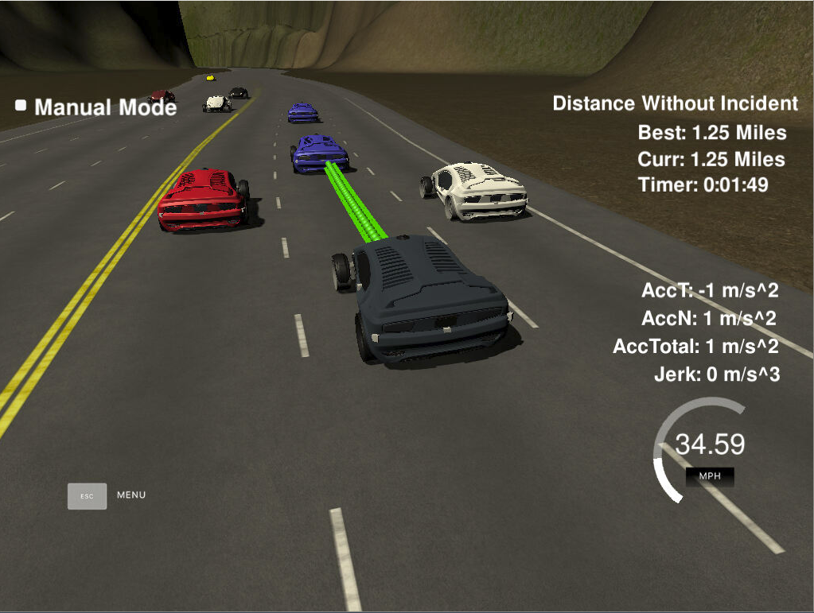

# CarND-Path-Planning-Project
Self-Driving Car Engineer Nanodegree Program
   

### Goals
In this project your goal is to safely navigate around a virtual highway with other traffic that is driving +-10 MPH of the 50 MPH speed limit. You will be provided the car's localization and sensor fusion data, there is also a sparse map list of waypoints around the highway. The car should try to go as close as possible to the 50 MPH speed limit, which means passing slower traffic when possible, note that other cars will try to change lanes too. The car should avoid hitting other cars at all cost as well as driving inside of the marked road lanes at all times, unless going from one lane to another. The car should be able to make one complete loop around the 6946m highway. Since the car is trying to go 50 MPH, it should take a little over 5 minutes to complete 1 loop. Also the car should not experience total acceleration over 10 m/s^2 and jerk that is greater than 10 m/s^3.

#### The map of the highway is in data/highway_map.txt
Each waypoint in the list contains  [x,y,s,dx,dy] values. x and y are the waypoint's map coordinate position, the s value is the distance along the road to get to that waypoint in meters, the dx and dy values define the unit normal vector pointing outward of the highway loop.

The highway's waypoints loop around so the frenet s value, distance along the road, goes from 0 to 6945.554.

## Basic Build Instructions

1. Clone this repo.
2. Make a build directory: `mkdir build && cd build`
3. Compile: `cmake .. && make`
4. Run it: `./path_planning`.

## Input From Simulator

#### Main car's localization Data (No Noise)

["x"] The car's x position in map coordinates
["y"] The car's y position in map coordinates
["s"] The car's s position in frenet coordinates
["d"] The car's d position in frenet coordinates
["yaw"] The car's yaw angle in the map
["speed"] The car's speed in MPH

#### Previous path data given to the Planner

//Note: Return the previous list but with processed points removed, can be a nice tool to show how far along
the path has processed since last time. 

["previous_path_x"] The previous list of x points previously given to the simulator

["previous_path_y"] The previous list of y points previously given to the simulator

#### Previous path's end s and d values 

["end_path_s"] The previous list's last point's frenet s value

["end_path_d"] The previous list's last point's frenet d value

#### Sensor Fusion Data, a list of all other car's attributes on the same side of the road. (No Noise)

["sensor_fusion"] A 2d vector of cars and then that car's [car's unique ID, car's x position in map coordinates, car's y position in map coordinates, car's x velocity in m/s, car's y velocity in m/s, car's s position in frenet coordinates, car's d position in frenet coordinates. 

## Details

1. The car uses a perfect controller and will visit every (x,y) point it recieves in the list every .02 seconds. The units for the (x,y) points are in meters and the spacing of the points determines the speed of the car. The vector going from a point to the next point in the list dictates the angle of the car. Acceleration both in the tangential and normal directions is measured along with the jerk, the rate of change of total Acceleration. The (x,y) point paths that the planner recieves should not have a total acceleration that goes over 10 m/s^2, also the jerk should not go over 50 m/s^3. (NOTE: As this is BETA, these requirements might change. Also currently jerk is over a .02 second interval, it would probably be better to average total acceleration over 1 second and measure jerk from that.

2. There will be some latency between the simulator running and the path planner returning a path, with optimized code usually its not very long maybe just 1-3 time steps. During this delay the simulator will continue using points that it was last given, because of this its a good idea to store the last points you have used so you can have a smooth transition. previous_path_x, and previous_path_y can be helpful for this transition since they show the last points given to the simulator controller with the processed points already removed. You would either return a path that extends this previous path or make sure to create a new path that has a smooth transition with this last path.

---
## Implementation

This project was implementation with following 3 part.
1. Generate Trajectory
2. Make Prediction
3. Make Decision

### Generate Trajectory (from Line 365 to Line 476)

This section of code generates the trajectory by calculating the speed behavior and coordinates of car and previous path.
  - Get the waypoint Data
    - An (x,y) global map position
    - A Frenet s value
    - A Frenet d unit normal vector
  - Interpolating Points the position of above data by estimate the location of points between the known waypoints using fitting polynomials.

### Make Prediction (from Line 367 to Line 317)

This section of code predicts using sensor fusion data.
  - First find which lane is front of the car locate.
  - Second calculated the car speed.
  - third check whether the car is located same lane with my car or left of my car or right of my car.
  - lastly check within 30 m range of my car from ahead or right or left.

Using this info next Decision Making section will be determining.

### Make Decision (from Line 325 to Line 358)

This section of code decides what to do for following situation

  - What to do if there is a car ahead and driving too slowly?
     - move to left lane, if I am not driving leftist lane and there isn't a car left lane

     - move to right lane, if I am not driving rightest land and there isn't a car right lane

     - if I cannot chang any lane, slow down speed by 5 mps to avoided collision

  - What to do if there isn't a car ahead of my car?
     - move to center lane, if I am not driving center lane and there isn't any car driving center lane.

     - adjust speed depend on my current speed. Begging of the simulation, the car was driving too slowing.
        - if I am driving between 30 mph to 49.5 mph, speed up by 2.5 mph
        - if I am driving between 25 mph to 30 mph, speed up by 5 mph
        - if I am driving below 25 mph, speed up by 7.5 mph.

## Continue to Drive without incident

